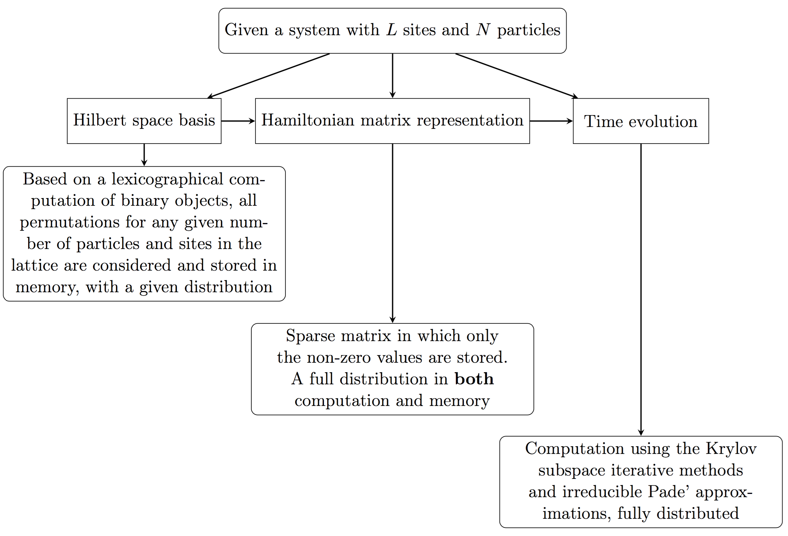

<hr>
<h2>DSQMKryST</h2>

Massively parallel implementation and approaches to simulate quantum dynamics using Krylov subspace techniques

Current version    : v0.2 (January, 2017)

Documentation: https://mbrenesn.github.io/DSQMKryST/html/index.html

<br><hr>
<h3>Synopsis</h3>

DSQMKryST is an application based on implemented distributed memory parallel algorithms in order to provide a computational framework suitable for massively parallel supercomputers to study the dynamics of one-dimensional quantum systems.

The main idea is to approximate the solutions to the time-dependent Schroedinger equation by means of Krylov subspace techniques using a carefully constructed and distributed basis for the Hilbert subspace and a sparse matrix representation of the Hamiltonian of the system. 

Currently calculates estimations on the Loschmidt echo to show the basic scope of the application, but adding estimation to other quantum observables can be integrated with ease (such as magnetization and imbalance, or even entanglement entropy).

The application depends on [PETSc](https://www.mcs.anl.gov/petsc/), [SLEPc](http://slepc.upv.es) and [Boost](http://www.boost.org)

<br><hr>
<h5>Approaches</h5>

There are two different approaches implemented: RingComm and NodeComm. Please refer to the [manuscript](docs/PP_v2.0.pdf) for details on the pros and cons of each one of them.

<br><hr>
<h3>Get Started</h3>

<h5>Instructions for a Linux cluster</h5>

You'll need PETSc, SLEPc and Boost to start with. These may already be installed in your cluster or personal computer, however we encourage you to download and install these libraries on your own as the PETSc build required to compile and execute the application properly requires custom settings - configuration and compilation of these libraries it's easy and gives you the freedom to customize as you want your installation.

You probably won't have root access to the cluster, which means the libraries have to be installed in a directory you have access to, so go ahead and download the source files in your home directory or another directory of your choosing:

```bash
wget http://ftp.mcs.anl.gov/pub/petsc/release-snapshots/petsc-3.7.5.tar.gz
wget http://slepc.upv.es/download/download.php?filename=slepc-3.7.3.tar.gz
wget https://sourceforge.net/projects/boost/files/boost/1.63.0/boost_1_63_0.tar.gz
```

Might want to check for later versions or different URL's if the ones posted are broken or no longer valid.
Extract the files:

```bash
tar -xzf [petsc-compressed-file]
tar -xzf [slepc-compressed-file]
tar -xzf [boost-compressed-file]
```

PETSc and SLEPc require ```environment variables```, you can set these by means of

```bash
export PETSC_DIR = /path/to/petsc/petsc-3.7.5
export PETSC_ARCH = arch_name
export SLEPC_DIR = /path/to/slepc/slepc-3.7.3
export BOOST_DIR = /path/to/boost/boost_1_63_0
```

```PETSC_ARCH``` is a local name for your installation, as more than one installation of PETSc with different configuration can be built.   
While you're at it, go ahead and load your MPI (Intel, OpenMPI, MPICH) module and find it's path:

```bash
which mpicxx
```

This will return a ```/path/to/mpi/bin/mpicxx```, set

```bash
export MPI_DIR = /path/to/mpi
```

Careful not to add the ```/bin``` directory to the path. Check the FAQ section at the end of this README if you had trouble during this stage.

<h5>PETSc build</h5>

We now configure and build or own custom installation of PETSc.

```bash
cd /path/to/petsc/petsc-3.7.5
./configure --with-shared-libraries=1 --with-x=0 --with-mpi=1 MPI-DIR=$MPI_DIR --with-debugging=0 --with-scalar-type=complex --with-64-bit-ints --with-64-bit-indices --with-fortran=1 --with-fortran-kernels=1 --with-fortran-interfaces=1 --with-blas-lapack-dir=/path/to/blas-lapack
```

The last step is important - if you don't have a BLAS or LAPACK installation, one will be downloaded and built for you. You should pass the location or the local BLAS and LAPACK installation if you already have one. For Intel based systems, Intel MKL will give a much better performance, the path of MKL can be passed in the last option to accomplish this. See [this](https://www.mcs.anl.gov/petsc/documentation/installation.html#blas-lapack) for more info.

After configuration check that parameters match and follow the prompt to compile:

```bash
make PETSC_DIR=$PETSC_DIR PETSC_ARCH=$PETSC_ARCH all
```

and test

```bash
make PETSC_DIR=$PETSC_DIR PETSC_ARCH=$PETSC_ARCH test
```

<h5>SLEPc build</h5>

SLEPc relies on the configuration done for PETSc. Building SLEPc is a very simple process

```bash
cd /path/to/slepc/slepc-3.7.3
./configure
make SLEPC_DIR=$PWD PETSC_DIR=$PETSC_DIR PETSC_ARCH=$PETSC_ARCH
make test
```

<h5>Boost</h5>

Nothing to build here. Boost is a header-only library, no compiled library binaries or linking required.

<h5>Running a simple example</h5>

Access the directory of one of the implemented methods (NodeComm or RingComm) and use the makefile provided.

```bash
cd RingComm/
make
```

and execute using the MPI execution command

```bash
mpirun -np <procs> ./aubry_RC.x
```

The ```job.sh``` file shows a simple job submission script for cluster using PBS.

<br><hr>
<h3>DSQMKryST structure and functionality</h3>



There are two different approaches in terms of distribution (NodeComm and RingComm), the best suitable algorithm will depend on local memory resources and desired problem size. Please consult [this](./docs/PP_v2.0.pdf).

<br><hr>
<h3>FAQ</h3>

<h5>I don't have MPI on my machine</h5>

Configure PETSc ```--with-mpi=1``` and an MPI installation will be carried out for you. On a cluster you have to configure PETSc with the local MPI installation to attain good performance, as shown in the previous section. Consult [the PETSc installation](https://www.mcs.anl.gov/petsc/documentation/installation.html) page for more details. 

<h5>I don't like Github! How do I get the code?</h5>

Green button at the top right - you can download the files instead of cloning the repository.

<h5>You have implemented the Hamiltonian operator for the Aubry-André model, how can I use this to study my own model?</h5>

Modify the ```SparseOp``` class. Particularly, you'll be interested in the ```construct_AA_hamiltonian``` public method and the ```determine_allocation_details_``` private method. Currently there's no way to introduce a new model without digging into the code, but work is being done towards this direction. Modifications to the actual code are not difficult, but require some basic knowledge of MPI and PETSc functionality.   

One can think of constructing the diagonal terms of the Hamiltonian and the off-diagonal terms in two different steps (currently this is done in one step); as only the off-diagonal terms require careful attention, there's a penalty in performance with this approach though. We are interested to hear comments and add functionality for new physical models.

<h5>What about measuring expectation values of other observables?</h5>

Use a dense/sparse matrix representation of the observable using the basis from the ```Basis``` class and operate it with the time-evolved states. [This example](https://github.com/mbrenesn/QuDyn) shows a way to measure other observables. 


